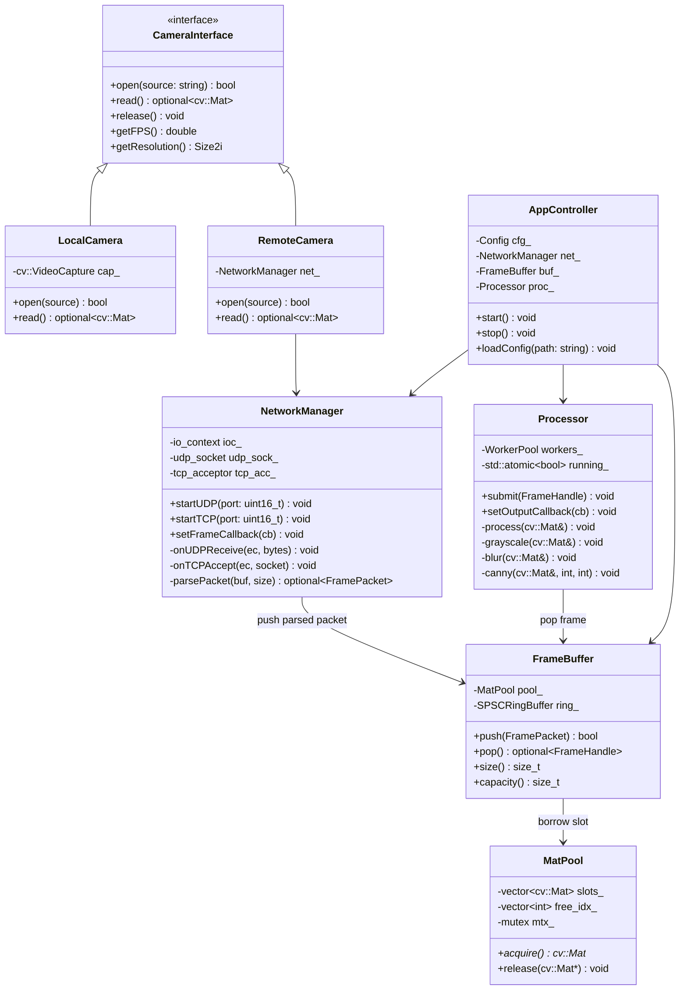

# OmniVision-Edge — System Blueprint

## Section 1: Architecture Overview

### Mermaid Class Diagram



---

## Binary Communication Protocol

### Design Decisions

| Vấn đề | Giải pháp |
|---|---|
| Struct padding | `#pragma pack(push,1)` + `static_assert` để verify |
| Endianness | Little-endian mặc định (ESP32 + x86/ARM64 đều LE); helper `htole32` |
| Framing | Magic số `0xCAFEF00D` ở đầu header để detect packet bắt đầu |
| Integrity | XOR16 checksum trên toàn bộ header bytes |
| Zero-copy | Payload trỏ thẳng vào socket buffer khi parse; chỉ copy vào MatPool |

### Header Layout (24 bytes cố định, không padding)

```
Offset  Size  Field           Description
------  ----  -----           -----------
0       4     magic           0xCAFEF00D — frame start marker
4       4     frame_id        monotonic counter từ nguồn
8       8     timestamp_us    microseconds since Unix epoch
16      2     width           pixel width
18      2     height          pixel height
20      1     pixel_format    0=GRAY 1=BGR 2=JPEG 3=H264_NAL
21      1     flags           bit0=keyframe bit1=drop_ok bit2=compressed
22      2     checksum        XOR16 của bytes [0..21]
--- payload_size không ở header, tính từ width*height*channels hoặc JPEG size ---
```

> **Senior Note**: Không đưa `payload_size` vào header để tránh phụ thuộc vào giá trị mà attacker có thể giả mạo. Tính size từ `width * height * channels(pixel_format)` hoặc đọc JPEG SOI/EOI marker. Với JPEG, thêm field `jpeg_size: uint32_t` ở byte 22 (header sẽ thành 28 bytes).

### Flow kiểm tra packet hợp lệ

```
Read 24 bytes → check magic → recompute checksum → verify → decode payload_size → read N bytes payload
```

---

## Memory Strategy

### Tại sao Memory Pool thay vì `new/delete`?

- `new cv::Mat(H, W, CV_8UC3)` = `malloc` → kernel syscall → cache miss → latency spike.
- Trong realtime pipeline 30fps, mỗi frame tạo/xóa `Mat` → heap fragmentation theo thời gian.
- Memory Pool pre-allocate N slots cố định, `acquire()` chỉ là array index lookup → O(1), cache-hot.

### Tại sao Lock-free Ring Buffer?

- Mutex lock = context switch tiềm ẩn → không phù hợp với SPSC (single producer / single consumer).
- SPSC lock-free dùng `std::atomic` với `memory_order_acquire/release` → không cần kernel involvement.
- Chỉ SPSC mới an toàn lock-free đơn giản. MPMC cần ABA-safe algorithm phức tạp hơn.
